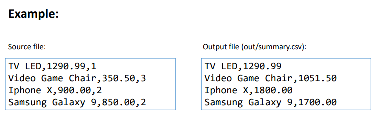
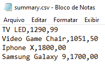

## Enunciado:

Fazer um programa para ler o caminho de um arquivo .csv
contendo os dados de itens vendidos. Cada item possui um
nome, preço unitário e quantidade, separados por vírgula. Você
deve gerar um novo arquivo chamado "summary.csv", localizado
em uma subpasta chamada "out" a partir da pasta original do
arquivo de origem, contendo apenas o nome e o valor total para
aquele item (preço unitário multiplicado pela quantidade),
conforme exemplo.

### Exemplo:

## Resultado

