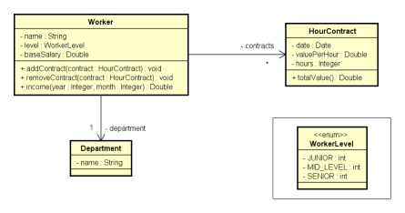
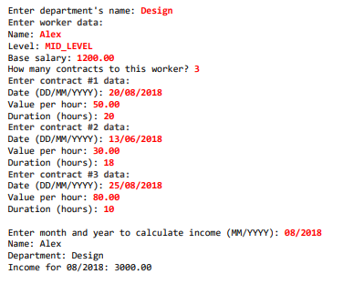

## Enunciado

Ler os dados de um trabalhador com N contratos (N fornecido pelo usuário). Depois, solicitar
do usuário um mês e mostrar qual foi o salário do funcionário nesse mês, conforme exemplo
(próxima página).

### Exemplos:

