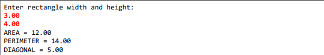

## Enunciado:
Fazer um programa para ler os valores da largura e altura
de um retângulo. Em seguida, mostrar na tela o valor de
sua área, perímetro e diagonal. Usar uma classe como
mostrado no projeto ao lado.

### Exemplos:

