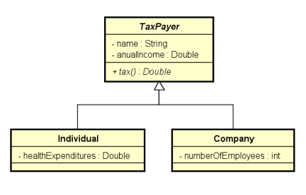

## Enunciado:
Fazer um programa para ler os dados de N contribuintes (N fornecido pelo usuário), os quais
podem ser pessoa física ou pessoa jurídica, e depois mostrar o valor do imposto pago por cada um,
bem como o total de imposto arrecadado.
Os dados de pessoa física são: nome, renda anual e gastos com saúde. Os dados de pessoa jurídica
são nome, renda anual e número de funcionários. As regras para cálculo de imposto são as
seguintes:  

Pessoa física: pessoas cuja renda foi abaixo de 20000.00 pagam 15% de imposto. Pessoas com
renda de 20000.00 em diante pagam 25% de imposto. Se a pessoa teve gastos com saúde, 50%
destes gastos são abatidos no imposto.  

Exemplo: uma pessoa cuja renda foi 50000.00 e teve 2000.00 em gastos com saúde, o imposto
fica: (50000 * 25%) - (2000 * 50%) = 11500.00
Pessoa jurídica: pessoas jurídicas pagam 16% de imposto. Porém, se a empresa possuir mais de 10
funcionários, ela paga 14% de imposto.
Exemplo: uma empresa cuja renda foi 400000.00 e possui 25 funcionários, o imposto fica:
400000 * 14% = 56000.00

### Exemplos:

